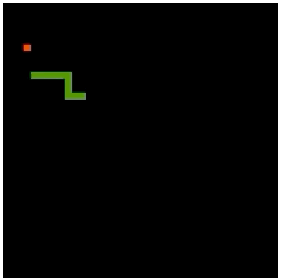
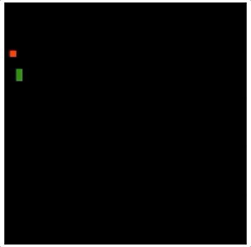
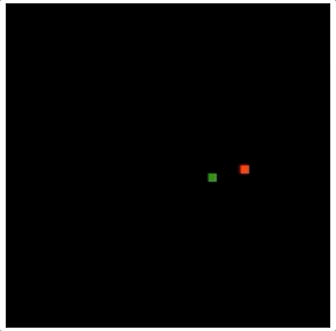

# Pretty Legendary Snakes

## Dependencies

* Docker

## Install/Run

* git clone

* `$> make up`

* Visit http://localhost:1234

## Progress

May 2 2020 - snake dies when eating self

May 2 2020 - snake grows when eating a cherry

<!--  -->

May 2 2020 - cherries spawn and the snake can eat them

<!--  -->

April 25 2020 - the snake moves with keyboard inputs and dies if touching the edges

<!--  -->

April 25 2020 - the snake moves in a straight line

<!--  -->